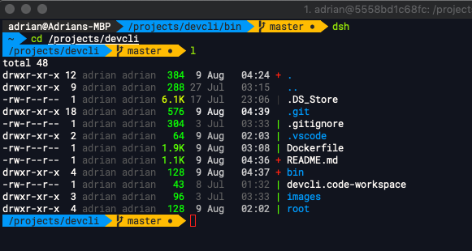
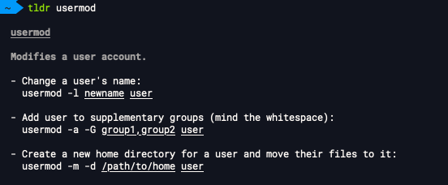

# Development CLI

# Problem
As a contractor I often work on different machines: Mac, Linx and Windows. Everytime I start on a new machine I have to use different tools to perform the same tasks. It takes effort to be across all the different tools, and to setup each new machine with those tools.

# Solution
This Docker image enables me to run all my faviourite preconfigured tools on any machine, whereever I am, with minimal effort. Some of the tools used:
* Scan through the Dockerfile to see various libraries used
* [oh-my-zsh](https://github.com/robbyrussell/oh-my-zsh)
* Docker CLI support which executes against the host docker daemon

| Feature        | Summary           | Screen Captures  |
| ------------- |-------------| -----|
| Readable shell      | <ul><li>Readable file sizes<li>Colour coding of files depending on their executable bit</li><li>Currently checked out branch in yellow, ```master``` shown below<li>Modified files shown with red + |  |
| tldr      | Easier to quickly process how a command works, rather than trawling through man      |  |
| z | Use ```z``` to easily navigate back to a previously visited directory      |  |
| completion | When typing a command in greyed text shows the previous executed command      | I have typed in sudo, and notice the text in grey following the prompt. This shows the last sudo command that I invoked. <br><br>Use the right arrow key to fill the command out<br> |

# Usage
## Prerequisites
* zsh is installed
* Install [Powerline](https://github.com/powerline/fonts) fonts
## Build
Build the docker image
```
$ git clone https://github.com/bootups/devcli.git
$ cd devcli/bin
$ build.sh
```
## Run
```
$ cd devcli/bin
$ dsh
```
Run so that container port 9000 is bound to host port 80
```
dsh -p=80:9000
```
# Customise
* Add and remove tools to the Dockerfile
* Modify the .zshrc file to add in favourite aliases and functions      